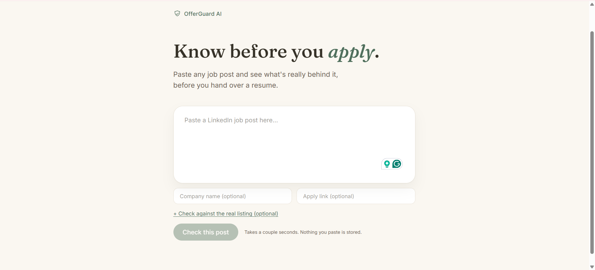
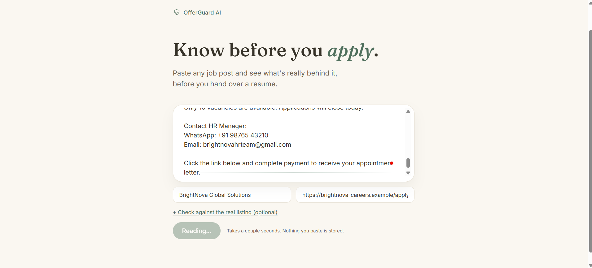
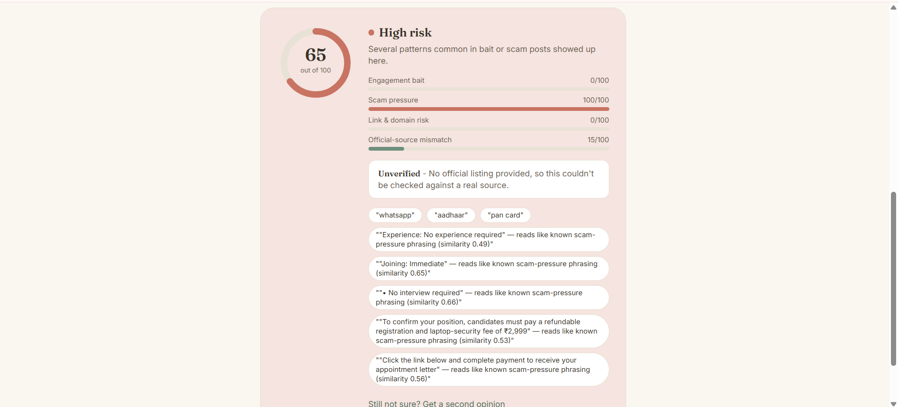
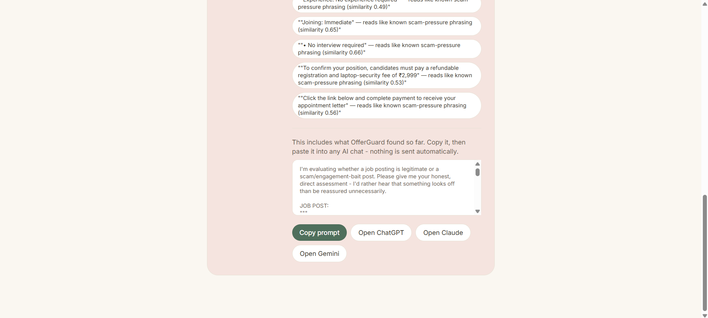
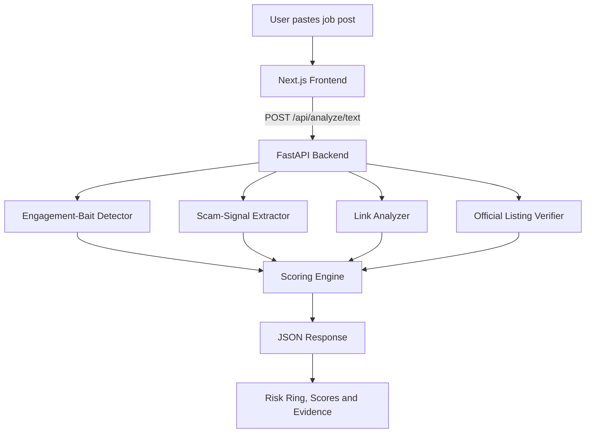

# 🛡️ OfferGuard AI

<div align="center">

### Know before you apply.

**OfferGuard AI analyzes job posts for engagement bait, scam-pressure signals, suspicious application links, and mismatches with official company listings—before applicants share a résumé or personal information.**

<br />

[](https://offerguard-ai.vercel.app/)
[](https://github.com/kcdoescode/offerguard-ai)

<br />


<br />

<a href="https://offerguard-ai.vercel.app/">
  
</a>

<p>
  <a href="https://offerguard-ai.vercel.app/"><strong>Try the live application →</strong></a>
</p>

</div>

---

## Overview

Fake, misleading, and engagement-driven job posts are increasingly difficult to distinguish from legitimate opportunities.

Some posts are designed to:

- collect comments, follows, tags, or direct messages;
- redirect applicants to suspicious or unrelated domains;
- request registration fees or sensitive identity information;
- harvest résumés through unofficial forms;
- create urgency with phrases such as “limited seats” or “immediate joining”;
- imitate a real company vacancy without matching its official listing.

OfferGuard AI evaluates these signals across multiple independent categories and explains **why** a post received its risk score.

🌐 **Live application:** [https://offerguard-ai.vercel.app/](https://offerguard-ai.vercel.app/)

> OfferGuard AI reports risk indicators—not accusations. It is a decision-support tool and should not be treated as proof of fraud.

---

## ✨ Core Features

### 🎯 Engagement-Bait Detection

Detects patterns intended to farm engagement, including:

- “Comment interested”
- “Follow our page”
- “Tag three friends”
- “DM for details”
- semantically similar reworded phrases

It combines exact keyword detection with sentence-embedding similarity, allowing the system to identify meaning even when the wording changes.

### 🚨 Scam-Pressure Detection

Identifies potentially risky language related to:

- registration or application fees;
- urgent joining pressure;
- off-platform communication;
- guaranteed selection;
- no-interview claims;
- Aadhaar, PAN, bank, OTP, or identity-document requests.

High-severity payment or identity-document signals can apply a minimum risk floor even when the blended score is lower.

### 🔗 Link and Domain Analysis

Checks submitted application URLs for:

- URL shorteners;
- missing HTTPS;
- suspicious or unrelated domains;
- mismatch between the claimed company and application domain.

### ✅ Official Listing Verifier

Compares the submitted job post with text copied from an official company careers page.

The comparison is semantic rather than exact, producing one of four results:

| Result | Meaning |
|---|---|
| `MATCH_FOUND` | Strong semantic similarity |
| `POSSIBLE_MATCH` | Partial or uncertain similarity |
| `NOT_FOUND` | Significant mismatch |
| `CANNOT_VERIFY` | Insufficient information |

### 🔍 Explainable Risk Scoring

Every result includes:

- an overall risk score;
- a Low, Medium, or High label;
- individual category scores;
- the exact text evidence that triggered each signal;
- an animated risk ring and category breakdown.

---

## 📸 Application Screenshots

<table>
  <tr>
    <td width="50%" align="center">
      
      <br /><strong>1. Paste a job post</strong>
    </td>
    <td width="50%" align="center">
      
      <br /><strong>2. Run the analysis</strong>
    </td>
  </tr>
  <tr>
    <td width="50%" align="center">
      
      <br /><strong>3. Review the risk score and evidence</strong>
    </td>
    <td width="50%" align="center">
      
      <br /><strong>4. Copy a second-opinion prompt</strong>
    </td>
  </tr>
</table>

---

## 🧠 How the AI Works

OfferGuard AI uses a hybrid detection pipeline.

### 1. Rule-Based Detection

A keyword and regular-expression layer catches explicit patterns quickly, such as:

```text
Pay a registration fee
Comment interested
Contact us on WhatsApp
Share your Aadhaar details
```

### 2. Semantic Similarity

Each sentence is converted into a vector using:

```text
sentence-transformers/all-MiniLM-L6-v2
```

The sentence vector is compared with reference phrases stored for each risk category.

This allows the system to recognize that:

```text
Smash that follow button
```

and:

```text
Follow our page for job alerts
```

express a similar intent, even though their wording is different.

The Official Verifier applies the same concept at paragraph level to compare a submitted post with an official listing.

---

## 🏗️ Architecture



### Request Flow

```text
Browser
   │
   ▼
Next.js frontend
   │
   └── POST /api/analyze/text
                │
                ▼
          FastAPI backend
                │
     ┌──────────┼───────────┬────────────────┐
     ▼          ▼           ▼                ▼
 Engagement   Scam       Link Risk      Official Listing
 Detector     Detector   Analyzer       Verifier
     └──────────┴───────────┴────────────────┘
                │
                ▼
          Scoring Engine
                │
                ▼
      Risk score + evidence
```

---

## 🧰 Tech Stack

| Layer | Technology |
|---|---|
| Frontend | Next.js App Router, TypeScript, Tailwind CSS |
| Backend | FastAPI, Pydantic, Uvicorn |
| AI / NLP | Sentence Transformers, `all-MiniLM-L6-v2` |
| Detection | Keyword rules, regex patterns, semantic similarity |
| Runtime | Local CPU inference |
| API Format | REST + JSON |
| Deployment | Vercel frontend, Render backend |

---

## 🌐 Live Deployment

| Service | URL |
|---|---|
| Frontend | [https://offerguard-ai.vercel.app/](https://offerguard-ai.vercel.app/) |
| Backend | [https://offerguard-backend-xqlo.onrender.com/](https://offerguard-backend-xqlo.onrender.com/) |

The Render service may take a few seconds to wake after inactivity on a free hosting plan.

---

## 📊 Evaluation

Eight manually designed test cases exercise different parts of the pipeline through:

```http
POST /api/analyze/text
```

| # | Test Scenario | Bait | Scam | Link | Official | Overall |
|---:|---|---:|---:|---:|---|---|
| 1 | Clean, legitimate post | 0 | 0 | 0 | — | **0 · Low** |
| 2 | Exact engagement bait | 50 | 0 | — | — | **22 · Low** |
| 3 | Reworded semantic bait | Model-dependent | 0 | — | — | Model-dependent |
| 4 | Scam-pressure combination | 0 | 80 | — | — | **44 · Medium** |
| 5 | Shortened and mismatched link | 0 | 0 | 65 | — | **16 · Low** |
| 6 | Genuine official-listing match | 0 | 0 | 0 | `MATCH_FOUND` expected | Model-dependent |
| 7 | Clear official-listing mismatch | 25 | Model-dependent | — | 70 | **≈29 · Low** |
| 8 | Payment request + fragmented bait | 25 | 35 | — | — | **35 · Medium** |

> `—` means the category was not evaluated because the required input was not provided. It is excluded from the average rather than treated as safe.

### Bug Found During Evaluation

The eighth test case exposed a scoring weakness.

A short payment-fee post initially received only `11 · Low` because:

1. the exact phrase was missing from the keyword library;
2. the semantic similarity score fell below the threshold;
3. the detected signal was diluted by unrelated categories.

The issue was addressed by:

- expanding the payment-related keyword list;
- lowering the scam-pressure semantic threshold;
- adding a severity floor for payment and identity-document requests.

---

<details>
<summary><strong>View full evaluation inputs</strong></summary>

### 1. Clean Post

```json
{
  "raw_text": "We are hiring a Frontend Developer to join our Mumbai office. 2+ years of React experience required. Apply through our official careers page.",
  "company_name": "Zoho",
  "apply_url": "https://www.zoho.com/careers/frontend-developer"
}
```

### 2. Exact Engagement Bait

```json
{
  "raw_text": "Comment interested and drop your resume below to be considered for this opening."
}
```

### 3. Reworded Semantic Bait

```json
{
  "raw_text": "If this role interests you, smash that follow button on our page and we will reach out with next steps."
}
```

### 4. Scam-Pressure Combination

```json
{
  "raw_text": "Immediate joining required, no interview needed! Contact us on WhatsApp for details. Pay a small registration fee to confirm your seat."
}
```

### 5. Link and Domain Risk

```json
{
  "raw_text": "Exciting opportunity to join our team, apply now!",
  "company_name": "Infosys",
  "apply_url": "https://bit.ly/3xyzjob"
}
```

### 6. Genuine Official Match

```json
{
  "raw_text": "We are hiring a Backend Software Engineer to join our Bangalore team. Experience with Python and cloud infrastructure required. Apply through our official careers portal.",
  "official_listing_text": "Backend Software Engineer - Bangalore. We're looking for an engineer experienced in Python and cloud infrastructure to join our growing team. Apply via the official careers portal.",
  "company_name": "Infosys",
  "apply_url": "https://apply.workday.com/infosys/job/backend-engineer-bangalore"
}
```

### 7. Clear Official Mismatch

```json
{
  "raw_text": "Urgent hiring! Data entry work from home, earn 50000 per month, no experience needed, comment interested now!",
  "official_listing_text": "Backend Software Engineer - Bangalore. We're looking for an engineer experienced in Python and cloud infrastructure to join our growing team.",
  "company_name": "Infosys"
}
```

### 8. Payment Request and Fragmented Bait

```json
{
  "raw_text": "Pay the application charges today. Drop interested below and message us privately for the form."
}
```

</details>

---

## 🔐 Safety and Privacy

OfferGuard AI follows a privacy-first design:

- submitted text is not stored;
- no database is currently used;
- results exist only in the API response;
- no LinkedIn or careers-page scraping is performed;
- every input is manually provided by the user;
- output uses risk-based language instead of direct accusations;
- companies and individuals are not labelled fraudulent without verified evidence.

Always verify a vacancy through the employer’s official website before applying or sharing personal information.

---

## ⚠️ Known Limitations

- **Reference phrases are manually curated.** New slang and unfamiliar phrasing may not be detected.
- **The Official Verifier requires pasted text.** It does not independently fetch company career pages.
- **There is no persistence layer.** Analysis history, reputation reports, and cross-user duplicate detection are not yet supported.
- **The evaluation set is small.** The current test cases demonstrate system behaviour but do not establish production-level precision or recall.
- **Blended scoring can reduce visibility of isolated signals.** Category-level evidence should always be reviewed alongside the overall score.
- **Semantic output can vary slightly.** Results may depend on thresholds and model behaviour.

---

## 🚀 Run Locally

### Prerequisites

Install:

- Node.js 18 or later;
- Python 3.10 or later;
- Git.

### 1. Clone the Repository

```bash
git clone https://github.com/kcdoescode/offerguard-ai.git
cd offerguard-ai
```

### 2. Start the Frontend

```bash
cd frontend
npm install
npm run dev
```

Open:

```text
http://localhost:3000
```

### 3. Start the Backend

Open a second terminal:

```bash
cd backend
python -m venv venv
```

#### Windows PowerShell

```powershell
venv\Scripts\Activate.ps1
```

#### Windows Command Prompt

```cmd
venv\Scripts\activate.bat
```

#### macOS / Linux

```bash
source venv/bin/activate
```

Install dependencies and start the API:

```bash
pip install -r requirements.txt
uvicorn app.main:app --reload
```

Open the interactive API documentation:

```text
http://localhost:8000/docs
```

---

## 📡 Main API Endpoint

```http
POST /api/analyze/text
```

### Example Request

```json
{
  "raw_text": "Immediate joining. No interview required. Pay a registration fee to reserve your position.",
  "company_name": "Example Company",
  "apply_url": "https://example.com/apply",
  "official_listing_text": "Optional official job listing text"
}
```

The response includes the overall score, risk level, category-level scores, and evidence detected by the analysis pipeline.

---

## 🗂️ Project Structure

```text
offerguard-ai/
├── assets/
│   ├── offerguard-home.png
│   ├── offerguard-analyzing.png
│   ├── offerguard-risk-report.png
│   └── offerguard-second-opinion.png
│
├── backend/
│   ├── app/
│   │   ├── services/
│   │   │   ├── semantic_matcher.py
│   │   │   └── ...
│   │   └── main.py
│   └── requirements.txt
│
├── frontend/
│   ├── app/
│   │   ├── globals.css
│   │   ├── layout.tsx
│   │   └── page.tsx
│   ├── public/
│   ├── package.json
│   └── next.config.ts
│
└── README.md
```

---

## 🛣️ Roadmap

- [ ] Recruiter trust scoring from manually supplied profile data
- [ ] User-submitted reputation and reporting engine
- [ ] Domain-level report aggregation
- [ ] Duplicate and template detection with FAISS
- [ ] Supervised classifier trained on labelled examples
- [ ] Analysis history and exportable reports
- [ ] Expanded multilingual risk-phrase support
- [x] Frontend deployed on Vercel
- [x] Backend deployed on Render

---

## 🤝 Responsible Use

OfferGuard AI is intended for educational, portfolio, and applicant-safety purposes.

It should not be used to publicly accuse an employer, recruiter, or individual of fraud based only on an automated score. Results must be combined with independent verification and human judgment.

---

<div align="center">

### Built to help applicants pause, verify, and apply more safely.

**OfferGuard AI · Next.js · FastAPI · Local NLP**

[Live Demo](https://offerguard-ai.vercel.app/) · [GitHub Repository](https://github.com/kcdoescode/offerguard-ai)

</div>